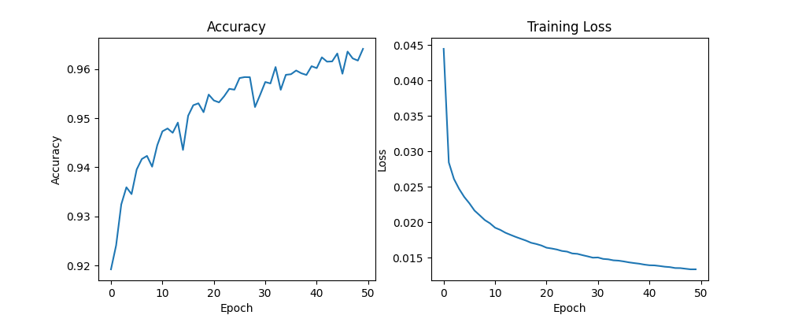

# nnMNIST 

    

MNIST handwritten digit classification using **PyTorch**, trained on **CPU only**.

This project is a framework-based counterpart to `nnMNISTnoFW`, designed to perform a **fair and controlled comparison** between a neural network implemented from scratch and the same model implemented using a professional deep learning framework.

---

## Introduction

This repository implements a simple neural network for handwritten digit classification using **PyTorch**, keeping the model architecture and training pipeline intentionally minimal.

The objective is not to achieve state-of-the-art performance, but to understand:
- How PyTorch structures models, datasets, and training loops
- What PyTorch abstracts away compared to a manual NumPy implementation
- When GPU acceleration is *not* necessary
- How framework-based workflows compare to from-scratch approaches

All training and inference are performed on **CPU**.

---

## Project Motivation

This project follows the `nnMNISTnoFW` repository, where the same problem was solved without using any deep learning framework.

The motivation here is to:
- Transition to PyTorch while keeping full control over the training logic
- Maintain identical conditions to allow a **fair comparison**
- Understand the practical trade-offs between low-level and framework-based implementations
- Evaluate the impact of modern optimization tools provided by professional frameworks

---

## Comparison with From-Scratch Implementation

To ensure a meaningful comparison with `nnMNISTnoFW`, the following constraints were enforced:

- Same dataset (MNIST)
- Same preprocessing and normalization
- Same model architecture
- Same training/inference split
- CPU-only execution
- Comparable training setup

This ensures that any differences in behavior, performance, or training time are due to the framework itself and not architectural or hardware changes.

---

## Model Architecture

The model mirrors the architecture used in the from-scratch implementation:

- Input layer: `28 × 28 = 784` features
- Hidden layer: Linear(784 → 10) + ReLU
- Output layer: Linear(10 → 10)
- Loss function: `CrossEntropyLoss`
- Optimizer: `Adam`

This minimal architecture allows the training behavior to remain interpretable and directly comparable to the NumPy-based implementation.

---

## Training & Inference

- Dataset: **MNIST** (CSV format)

- Normalization: pixel values scaled to [0, 1]

- **Batch** size: 10 and 50 **epochs**

- Training handled via DataLoader

- Device: **CPU** only

- Model weights saved using `torch.save`

### Training Time & CPU vs GPU Observations

Training was intentionally performed on CPU to match the from-scratch implementation.

- Training time (50 epochs): **~6 minutes**

- Hardware: Laptop CPU

- GPU tested for comparison: **NVIDIA GTX 1650 Ti (Laptop)**

Due to the simplicity of the network and the small batch size, GPU acceleration did not provide a meaningful speedup.

The overhead introduced by CPU↔GPU data transfers resulted in a bottleneck that made GPU and CPU training times comparable.

This highlights an important practical insight:

- **GPU** acceleration is **not** always **beneficial** for **small** models and lightweight workloads.

This avoids unnecessary CUDA dependencies and significantly reduces the size of the virtual environment. That is why I installed  to the venv cpu pytorch wheel: `pip3 install torch torchvision --index-url https://download.pytorch.org/whl/cpu`

### Inference utility

Finally at the `inference.py` script:

- Load the trained model weights `model.pth`
- Performs predictions on test images never seen during training
- Outputs the predicted digit class on and image at `resources/label_predicted.png`

---

## Results & Observations

After 50 training epochs, the PyTorch implementation achieves an accuracy of **~96%**, compared to **~84%** obtained with the from-scratch NumPy implementation with 1k epochs.

    

Although training time is slightly longer, the improvement in accuracy clearly demonstrates the advantages of using a professional deep learning framework.

Key observations:

- PyTorch provides optimized implementations of backpropagation and optimization algorithms

- Numerical stability and convergence behavior are significantly improved

- Modern optimizers and framework-level abstractions lead to better results with less manual tuning

This comparison highlights an important conclusion:

- *"For building and training neural networks in practice, using a professional and well-maintained framework is generally the better option, as it provides optimized, reliable, and production-ready tools."*

### Related Project

**nnMNISTnoFW** – Neural network implemented from scratch using NumPy and Pandas

Together, both repositories illustrate the progression from low-level neural network implementations to professional deep learning frameworks.

---

## References & Learning Resources

- **PyTorch Documentation**: https://pytorch.org/docs/stable/index.html

- **freeCodeCamp – PyTorch for Deep Learning & Machine Learning**: https://www.youtube.com/watch?v=aircAruvnKk

- **nnMNISTnoFW repo - Alejandro Fontes**: https://github.com/AlejandroFontesAlbeza/nnMNISTnoFW
